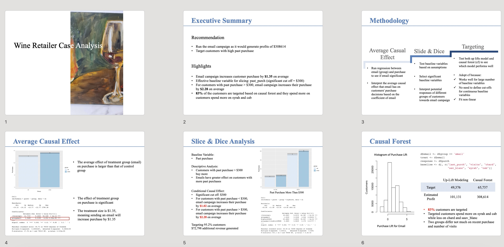

## Project Portfolio

### Data Analytics
[Customer Churn Analysis](pdf/Customer2.html)
> This project explores how businesses can use subscription data to boost retention and revenue. It includes: 1) KPI Analysis – Calculating churn rate, MRR, AOV, LTV, 2) Churn Prediction – Identifying churn factors with machine learning, 3) Strategic Insights – Visualizing findings with Tableau for better decisions.  

---
[Causal Effect: Email Targeting](pdf/Retailer.html)
> This project analyzes email marketing's impact on customer purchase behavior. It includes: 1) Causal Effect: Measuring the lift in purchases, 2) Segmentation Analysis: Segmenting customers by product preferences, 3) Insights: Providing targeted recommendations to boost revenue.
>

---

